# Deekshith Reddy

  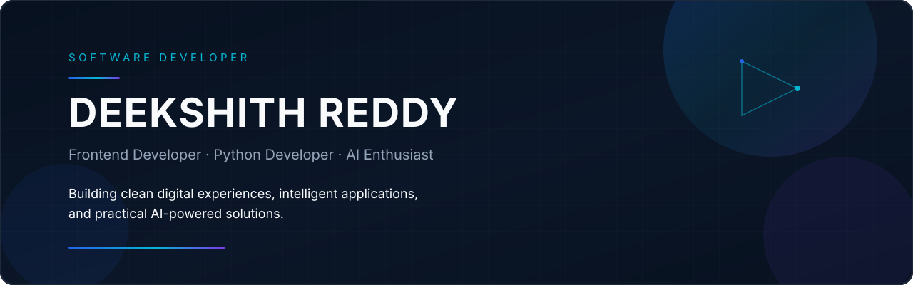

  
  
  
  

  

  

<table>
  <tr>
    <td width="170" valign="top" align="center">
      
    </td>
    <td valign="top">
      <h3>Hi, I'm Deekshith Reddy.</h3>
      
I'm a B.Tech student and developer focused on clean user interfaces, Python applications, automation tools, and practical AI-powered products.

      
I care about readable interfaces, useful software, and building things that are straightforward to understand and maintain.

      
<strong>Frontend Developer</strong> · <strong>Python Developer</strong> · <strong>AI Enthusiast</strong>

    </td>
  </tr>
</table>

  

## Focus

<table>
  <tr>
    <td width="50%">
      
    </td>
    <td width="50%">
      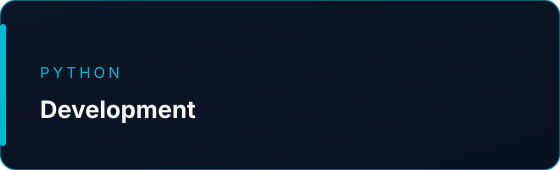
    </td>
  </tr>
  <tr>
    <td>
      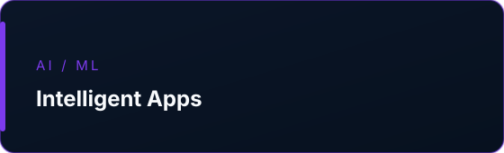
    </td>
    <td>
      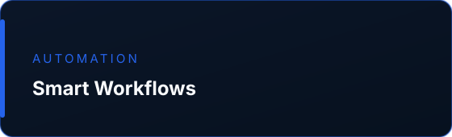
    </td>
  </tr>
</table>

  

## About Me

<table>
  <tr>
    <td width="50%" valign="top">
      
<strong>Who I am</strong> B.Tech student building software across frontend, Python, and applied AI.

      
<strong>What I build</strong> Web interfaces, desktop companions, automation tools, and data/AI notebooks grounded in real project work.

      
<strong>What I am learning</strong> Production-ready AI features, Electron desktop architecture, and stronger TypeScript frontend engineering.

    </td>
    <td width="50%" valign="top">
      
<strong>Frontend</strong> HTML, CSS, JavaScript, React, TypeScript, Next.js

      
<strong>Python</strong> Scripts, Flask apps, FastAPI services, notebooks

      
<strong>AI</strong> Groq-backed features, resume analysis, document parsing

      
<strong>Automation</strong> Task workflows, companion overlays, practical tooling

      
<strong>Problem solving</strong> Turn a clear user need into a small, working product.

    </td>
  </tr>
</table>

  

## Tech Stack

Verified from public repositories. Badges are grouped, not exhaustive.

**Frontend**

**Backend / Programming**

**AI / Data**

**Tools**

<strong>Detailed skills</strong>

- **Interfaces:** responsive HTML/CSS, React/Next.js dashboards, Tailwind UI work
- **Desktop:** Electron companion windows, tray-based Windows apps
- **Python:** Flask + SQLite task apps, FastAPI services, Pandas/Matplotlib analysis
- **AI features:** Groq API integration, Whisper transcription via Groq, PDF/DOCX parsing
- **Workflow:** Git/GitHub, VS Code, Cursor

  

## Featured Projects

Project cards below are generated from public GitHub data plus verified descriptions. Live Demo appears only when a public deployment URL exists.

<!-- PROJECTS:START -->

  <a href="https://github.com/Deekshith-Reddy-20/cue-ai">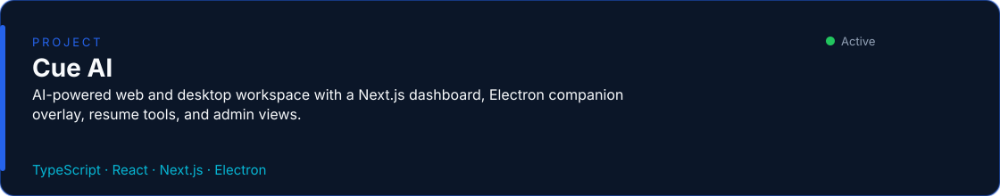</a>

  <a href="https://github.com/Deekshith-Reddy-20/cue-ai"><strong>View Project</strong></a>

  <a href="https://github.com/Deekshith-Reddy-20/savuor">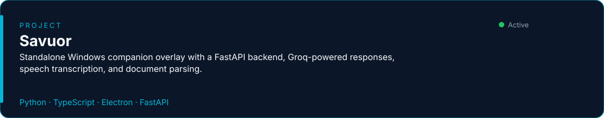</a>

  <a href="https://github.com/Deekshith-Reddy-20/savuor"><strong>View Project</strong></a>

  <a href="https://github.com/Deekshith-Reddy-20/portfolio">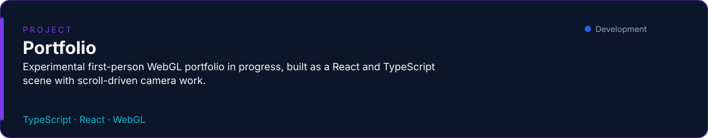</a>

  <a href="https://github.com/Deekshith-Reddy-20/portfolio"><strong>View Project</strong></a>

  <a href="https://github.com/Deekshith-Reddy-20/Ai-Ats-Score-Resume-analysis">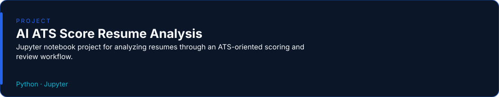</a>

  <a href="https://github.com/Deekshith-Reddy-20/Ai-Ats-Score-Resume-analysis"><strong>View Project</strong></a>

  <a href="https://github.com/Deekshith-Reddy-20/students-data-analysis">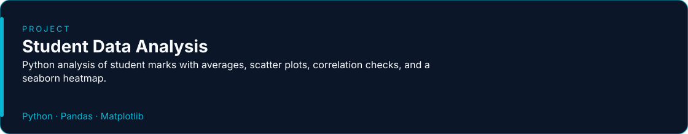</a>

  <a href="https://github.com/Deekshith-Reddy-20/students-data-analysis"><strong>View Project</strong></a>

  <a href="https://github.com/Deekshith-Reddy-20/The-daily-Tasks">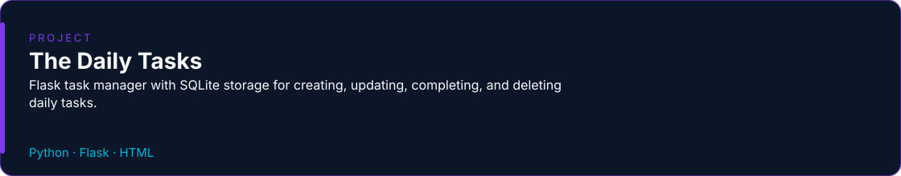</a>

  <a href="https://github.com/Deekshith-Reddy-20/The-daily-Tasks"><strong>View Project</strong></a>

  <a href="https://github.com/Deekshith-Reddy-20/password-generator">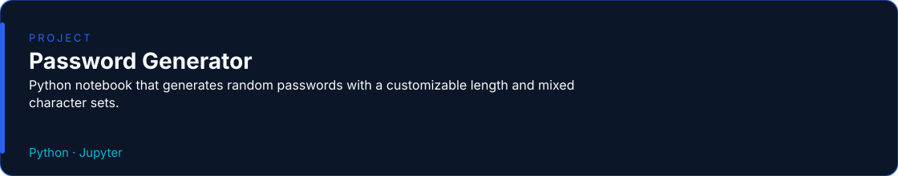</a>

  <a href="https://github.com/Deekshith-Reddy-20/password-generator"><strong>View Project</strong></a>

  <a href="https://github.com/Deekshith-Reddy-20/Social-Media-Landing-Page">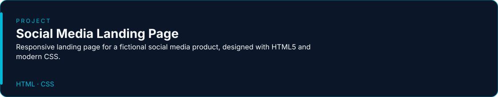</a>

  <a href="https://github.com/Deekshith-Reddy-20/Social-Media-Landing-Page"><strong>View Project</strong></a>

<strong>More repositories</strong>

- **[Admin Portal Demo](https://github.com/Deekshith-Reddy-20/admin-portal-dummy)** — Next.js admin dashboard demo used alongside Cue AI, including charts and a shareable local preview setup.

<!-- PROJECTS:END -->

  

## GitHub Statistics

Live stats from public activity. Numbers are not hardcoded.

<!-- STATS:START -->

  

  

<!-- STATS:END -->

<!-- LANGUAGES:START -->

  

  

<!-- LANGUAGES:END -->

  

## Currently Building

- **Cue AI** — Next.js web workspace and Electron desktop companion
- **Savuor** — Windows companion overlay with FastAPI and Groq
- **Portfolio** — first-person WebGL portfolio experience (in progress)
- Practical Python, data analysis, and AI-assisted product features

## Currently Learning

- Production AI application design with FastAPI and Groq
- Electron desktop architecture for companion-style tools
- Stronger TypeScript and Next.js frontend engineering
- Clearer data analysis and visualization with Python

<strong>Learning notes</strong>

I'm focusing on shipping small, complete products rather than collecting disconnected demos. Current work sits at the intersection of frontend polish, Python services, and useful AI features.

  

## Contact

  
  &nbsp;
  
  &nbsp;
  
  &nbsp;
  

  <a href="https://github.com/Deekshith-Reddy-20">GitHub</a>
  ·
  <a href="https://www.linkedin.com/in/deekshith-reddy-dwaram">LinkedIn</a>
  ·
  <a href="https://github.com/Deekshith-Reddy-20/portfolio">Portfolio</a>
  ·
  <a href="mailto:deekshithreddydwaram@gmail.com">Email</a>

  

